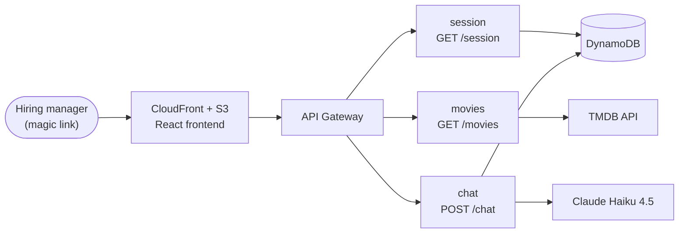

# CineAI

A personalized AI movie companion delivered via magic link.

Each hiring manager gets their own link — pre-loaded with their name, company logo, and a Claude persona that already knows who they are. The experience is built to feel like a knowledgeable friend who listens, not an algorithm serving metrics.

**<a href="https://henry-molina.dev/#showcase" target="_blank" rel="noopener noreferrer">Watch the demo →</a>** · Live instances are sent personally with each application — there's no public demo link, by design.

---

## What it does

- **Mood-based check-in** on first visit — Relaxed, Stressed, Nostalgic, Curious, Adventurous, Playful, or free text
- **Conversational discovery** — "something like Parasite but less dark," not a search box
- **Surprise Me** — a full-screen, single bold pick with a friend-pushing-back-on-your-instincts explanation, no clarifying questions
- **Watchlist** — saved picks persist across sessions and feed back into the system prompt as a taste signal
- **Return-visit recaps, not a stale mood** — mood is never written to storage; it lives only for the current visit. On a return visit, every past recommendation card reappears first, then Claude opens the conversation itself on top of them — scoped to just the immediately preceding visit, so it never recaps something further back than what's actually visible — and asks how they're feeling today, instead of replaying a mood snapshot from weeks ago. Mood can also drift mid-conversation if the user's tone shifts.
- **Guardrails that stay in scope** — Claude only discusses movies, but "movies" includes anything movie-related (kids' picks for a birthday party, group watches, mood-driven asks), not just a narrow notion of cinema

## Architecture



No running servers. Three Lambda handlers, no Express — API Gateway handles routing, <a href="https://middy.js.org/" target="_blank" rel="noopener noreferrer">Middy</a> handles the middleware chain (token validation, error handling, structured logging via AWS Lambda Powertools).

| Function | Route | Responsibility |
|---|---|---|
| `session` | `GET /session` | Token validation, session bootstrap, return-visit detection |
| `movies` | `GET /movies?query=` | TMDB search |
| `chat` | `POST /chat` | Claude + conversation history + watchlist updates |

All external calls (DynamoDB, Claude, TMDB) are wrapped with <a href="https://github.com/supermacro/neverthrow" target="_blank" rel="noopener noreferrer"><code>neverthrow</code></a>'s `ResultAsync`, so failure is part of the type signature instead of an invisible `throw` — handlers stay a clean pipeline with one error check at the edge. Clients and middleware take their dependencies as constructor params (factory pattern), so swapping a mock in for tests never touches the production code path.

Read the longer write-up: <a href="https://henry-molina.dev/blog/building-cineai.html" target="_blank" rel="noopener noreferrer">Three Decisions Behind CineAI's Backend</a>

## Stack

Node.js · TypeScript · React · AWS Lambda · DynamoDB · API Gateway · AWS CDK · CloudFront · Claude Haiku · TMDB API · Middy · neverthrow · Vitest

## Project structure

```
cineai/
├── backend/
│   ├── shared/        ← clients, middleware, prompts — consumed by all handlers
│   ├── session/        movies/        chat/      ← Lambda handlers
│   └── scripts/        ← generate-token.ts, update-token.ts
├── frontend/           ← React app
├── infra/              ← AWS CDK stack
└── portfolio/          ← this project's own landing page source
```

`@cineai/shared` is a local pnpm workspace package, not published to npm.

## Local development

```bash
pnpm install

# Frontend with mock data — no backend or AWS credentials needed
pnpm --filter frontend dev:mock
```

Mock mode (`VITE_MOCK=true`) implements the full API client with fake data and two pre-wired magic-link tokens:

| URL | Experience |
|---|---|
| `localhost:5173?token=first-visit` | Landing screen — mood selector, first-visit greeting |
| `localhost:5173?token=return-visit` | Chat directly — skips the mood selector; past recommendation cards reappear first, then Claude auto-opens with a recap and asks how they're feeling now |

For a real backend, copy `.env.example` to `.env` and fill in:

```
ANTHROPIC_API_KEY=
TMDB_API_KEY=
VITE_LOGO_DEV_API_KEY=  # see note below
DYNAMODB_TABLE_NAME=    # populated after first CDK deploy
BASE_URL=               # CloudFront URL, populated after first CDK deploy
```

**Why a `VITE_`-prefixed key is intentionally visible in the frontend bundle:** Logo.dev issues a *publishable* key (`pk_...`, same model as Stripe's publishable keys) — it's meant to sit in public-facing image URLs and can only fetch logo images, nothing account-level. `Landing.tsx` appends it to `session.logoUrl` at render time rather than baking it into the value stored in DynamoDB at token-generation time. That's deliberate: a stored, baked-in key means a future rotation silently breaks every already-issued magic link, since nothing re-reads it after creation. A client-side, build-time key means rotating it is a single frontend rebuild + redeploy, and every session — old or new — picks up the new key on its next page load.

## Testing

TDD throughout — tests are colocated with the module they test, no top-level `__tests__/` folder.

```bash
# Run all backend tests
pnpm --filter backend test

# Run backend tests in watch mode
pnpm --filter backend test:watch

# Run a single test file
cd backend && npx vitest run shared/src/clients/dynamo.test.ts

# Run all frontend tests
pnpm --filter frontend test

# Type-check shared package, backend, and frontend
cd backend/shared && npx tsc --noEmit
cd backend && npx tsc --noEmit
cd frontend && npx tsc --noEmit
```

## Deployment

AWS CDK, deployed under a custom domain with DNS-validated ACM certs via Route 53. API keys are read from environment variables at synth/deploy time and injected as Lambda env vars directly — no Secrets Manager needed at this scale. All commands assume API keys are in `.env` and AWS credentials use the `personal` profile.

**Backend (CDK)**

```bash
# Deploy full stack (auto-approves IAM changes)
source .env && AWS_PROFILE=personal ANTHROPIC_API_KEY=$ANTHROPIC_API_KEY TMDB_API_KEY=$TMDB_API_KEY pnpm --filter infra run deploy

# Preview changes vs live stack
source .env && AWS_PROFILE=personal ANTHROPIC_API_KEY=$ANTHROPIC_API_KEY TMDB_API_KEY=$TMDB_API_KEY pnpm --filter infra run diff

# Synthesise CloudFormation template only
# AWS_PROFILE required — HostedZone.fromLookup makes an API call at synth time
source .env && AWS_PROFILE=personal ANTHROPIC_API_KEY=$ANTHROPIC_API_KEY TMDB_API_KEY=$TMDB_API_KEY pnpm --filter infra run synth
```

Stack outputs after first deploy — copy both into `.env`: `ApiUrl` → used as `VITE_API_URL` when building the frontend, and `DistributionUrl` → set as `BASE_URL` for `generate-token`. The DynamoDB table name is CDK-generated (e.g. `CineaiStack-DatabaseSessions...-xxx`) — copy the real name into `DYNAMODB_TABLE_NAME` after first deploy.

**Frontend**

```bash
# Build against the live API and upload to S3
source .env && VITE_API_URL=$VITE_API_URL pnpm --filter frontend build
AWS_PROFILE=personal aws s3 sync frontend/dist/ s3://<bucket-name> --delete

# Invalidate CloudFront cache so users get the new bundle immediately
AWS_PROFILE=personal aws cloudfront create-invalidation --distribution-id <distribution-id> --paths "/*"
```

The S3 bucket name and CloudFront distribution ID are visible in the AWS console or via:

```bash
aws s3 ls | grep cineai
aws cloudfront list-distributions --query "DistributionList.Items[?DomainName=='<DistributionUrl>'].Id" --output text
```

**Magic link generation**

Usually only the company is known at apply-time — role and name surface later, if at all. Both are optional; the greeting and system prompt fall back gracefully, and Claude is told explicitly not to invent either. Patch them in later with `update-token` as they become known — the link itself never changes.

```bash
# Company only — the common case
source .env && AWS_PROFILE=personal DYNAMODB_TABLE_NAME=$DYNAMODB_TABLE_NAME BASE_URL=$BASE_URL \
  pnpm --filter backend generate-token "Stripe" "stripe.com"

# Everything known upfront
source .env && AWS_PROFILE=personal DYNAMODB_TABLE_NAME=$DYNAMODB_TABLE_NAME BASE_URL=$BASE_URL \
  pnpm --filter backend generate-token "Stripe" "stripe.com" "Engineering Manager" "Sarah Chen"

# Patch role and/or name in later, in whatever order you learn them — same token, same link
source .env && AWS_PROFILE=personal DYNAMODB_TABLE_NAME=$DYNAMODB_TABLE_NAME \
  pnpm --filter backend update-token "<token>" role "Engineering Manager"
source .env && AWS_PROFILE=personal DYNAMODB_TABLE_NAME=$DYNAMODB_TABLE_NAME \
  pnpm --filter backend update-token "<token>" name "Sarah Chen"
```

## Cost

Haiku 4.5, a 25-request budget per token, and a 30-day token expiry keep this comfortably inside AWS's free tier — **under $1/month** to operate at portfolio scale.

---

Built by <a href="https://henry-molina.dev" target="_blank" rel="noopener noreferrer">Henry Molina</a> as a portfolio piece — every hiring manager gets a link built for them, not a generic demo.
